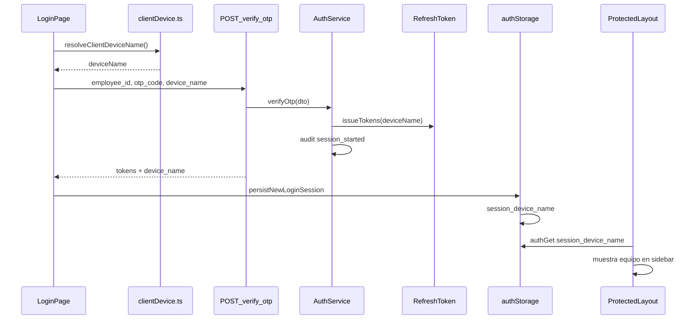

# Sesión y nombre del equipo cliente

Al iniciar sesión, la aplicación identifica desde qué **equipo o dispositivo** se conecta el usuario, lo envía al API y lo muestra en la tarjeta de sesión del sidebar.

---

## Flujo end-to-end



---

## Detección por plataforma

Implementación: [apps/web/src/lib/clientDevice.ts](../apps/web/src/lib/clientDevice.ts)

| Plataforma | Qué se obtiene | Ejemplo |
|------------|----------------|---------|
| **Electron (.exe)** | Hostname Windows vía `os.hostname()` en preload | `PC-SOPORTE-01` |
| **Capacitor (APK)** | Modelo del dispositivo desde User-Agent | `SM-G991B (Android)` |
| **Navegador web** | Sistema + navegador (no hay API de hostname) | `Windows · Chrome` |

### Electron

[apps/desktop/preload.cjs](../apps/desktop/preload.cjs) expone:

```javascript
getHostname: () => os.hostname()
```

El front lee `window.chatTicketsDesktop.getHostname()` (tipos en [vite-env.d.ts](../apps/web/src/vite-env.d.ts)).

### Navegador

Por restricciones de seguridad del navegador **no es posible** leer el nombre NetBIOS/hostname del PC. Para identificación corporativa por nombre de máquina, usar el **instalador Windows** ([DESKTOP_WINDOWS.md](DESKTOP_WINDOWS.md)).

El nombre inferido en web se cachea en `localStorage` bajo `chat_client_device_name`.

---

## API (backend)

### Request — `POST /api/v1/auth/verify-otp`

Campo opcional en el body (DTO [verify-otp.dto.ts](../apps/api/src/modules/auth/dto/verify-otp.dto.ts)):

```json
{
  "employee_id": "910204052230",
  "otp_code": "123456",
  "device_name": "PC-SOPORTE-01"
}
```

- Máximo 128 caracteres.
- Se normaliza con `trim()` en servidor.

### Response

Incluye `device_name` (string o `null`) junto con `access_token`, `refresh_token` y `user`.

### Persistencia

[AuthService.buildSessionPayload](../apps/api/src/modules/auth/auth.service.ts):

- Pasa `device_name` a `TokenService.issueTokens(..., deviceName)`.
- Se guarda en columna `RefreshToken.device_id` (Prisma).
- Auditoría: `auth.session_started` con meta `{ employee_id, device_name }`.

### Refresh — `POST /api/v1/auth/refresh`

El cliente reenvía el nombre almacenado como `device_id` (mismo campo en BD) para mantener la sesión asociada al equipo en rotaciones de token ([api.ts](../apps/web/src/lib/api.ts) → `refreshAccessToken`).

---

## Cliente (frontend)

### Login

[LoginPage.tsx](../apps/web/src/pages/LoginPage.tsx):

1. `await resolveClientDeviceName()` antes de `verifyOtp`.
2. `verifyOtp(employeeId, otpCode, deviceName)`.
3. `persistNewLoginSession({ ..., device_name })`.

### Almacenamiento

[authStorage.ts](../apps/web/src/lib/authStorage.ts) — clave `session_device_name`:

- Escritorio con `sessionStorage` (pestaña) o `localStorage` (móvil/APK) según `useDesktopTabScopedAuth()`.
- Se borra en `clearAllAuthData()` (logout).

### UI

[ProtectedLayout.tsx](../apps/web/src/pages/ProtectedLayout.tsx):

- Lee `authGet('session_device_name')`.
- Muestra bajo el rol: icono `ti-device-laptop` + texto del equipo.
- Clase CSS: `workspace-nav-panel__session-device`.

---

## Limitaciones y recomendaciones

| Escenario | Recomendación |
|-----------|----------------|
| Puesto fijo con nombre de PC obligatorio | Desplegar `.exe` Electron |
| Solo navegador | Aceptar etiqueta `Windows · Chrome` o política interna |
| APK móvil | Modelo de dispositivo; no es hostname de PC |
| Auditoría en servidor | Consultar logs `auth.session_started` y tabla `refresh_tokens.device_id` |

---

## Relacionado

- [BUILD_CLIENTES.md](BUILD_CLIENTES.md) — generar `.exe` y APK
- [UI_CHAT_Y_LAYOUT.md](UI_CHAT_Y_LAYOUT.md) — tarjeta de sesión en sidebar
- [CHANGELOG_MAYO_2026.md](CHANGELOG_MAYO_2026.md)
